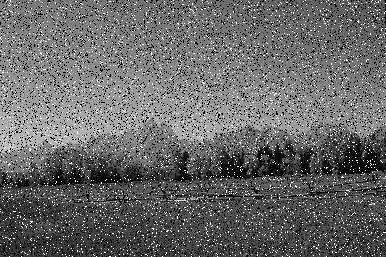
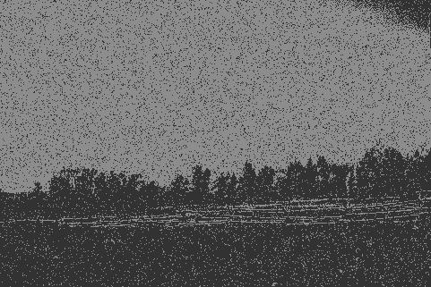
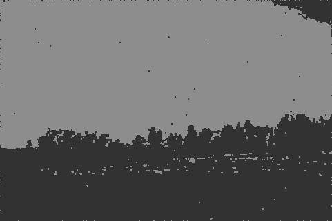
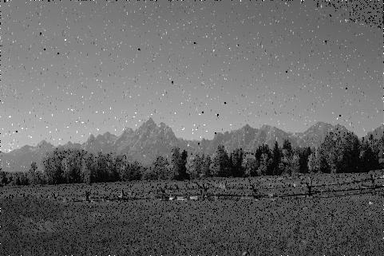

Noisy image restoration using Fuzzy c-means and kNN

Algorithm is used to segment and partly restore monochrome images, damaged mainly by salt and pepper noise

dataset used for testing: https://www.kaggle.com/dibakarsil/9-classes-noisy-image-dataset

Input image:

Segmented image:

Segmented denoised image:

Denoised image:

